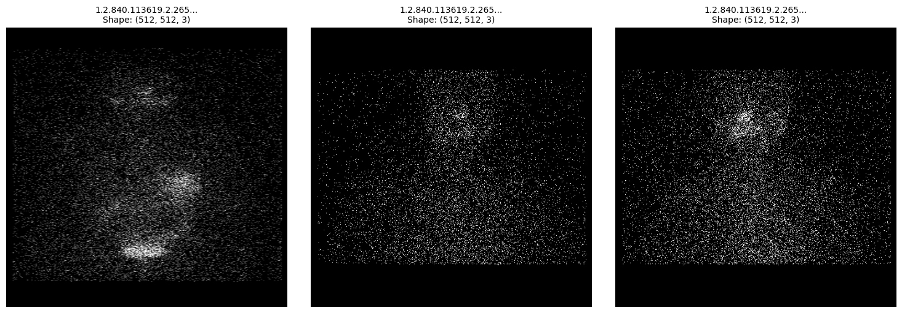

# Tài liệu Kỹ thuật: Quy trình Tiền xử lý & Huấn luyện Mô hình Phát hiện Tổn thương Tuyến giáp (DETR, Faster R-CNN, YOLOv7)

---

## 1. Tổng quan Bộ Dữ liệu Gốc (Dataset Overview)

### 1.1. Bản chất Dữ liệu Y khoa
* **Loại dữ liệu:** Ảnh xạ hình tuyến giáp (Thyroid Scintigraphy) và ảnh quét toàn thân (Whole-body Scan) lưu trữ dưới chuẩn y khoa **DICOM (`.dcm`)**.
* **Tổng số ca chụp:** Gồm khoảng **470 tệp `.dcm`**.
* **Kích thước ảnh gốc:**
  * Ảnh chụp khu trú vùng cổ/ngực: $256 \times 256$ hoặc $512 \times 512$ pixel.
  * Ảnh quét toàn thân (Whole-body scan): $1024 \times 256$ pixel.
* **Độ sâu bit (Bit Depth):** Dữ liệu dạng số nguyên 12-bit ($0 - 4095$) hoặc 16-bit ($0 - 65535$), lưu trữ giá trị đếm photon bức xạ thực tế từ máy SPECT.

### 1.2. Danh mục Đối tượng & Nhãn lâm sàng (Classes & Clinical Metadata)
* **Các lớp đối tượng cần phát hiện:**
  1. `thyroid`: Vùng mô tuyến giáp bắt giữ chất phóng xạ (vùng tổn thương/mô còn lại).
  2. `shoulder`: Vùng khớp vai (được đánh dấu để làm mốc đối chứng bức xạ nền cơ thể).
* **Các thuộc tính lâm sàng đi kèm trong bảng dữ liệu:**
  * `residual_state`: Đánh giá mức độ tồn dư mô giáp sau phẫu thuật/điều trị.
  * `TSH`, `TG`: Các chỉ số xét nghiệm sinh hóa máu của bệnh nhân.
  * `gap`: Khoảng thời gian (giờ/ngày) từ thời điểm uống liều phóng xạ đến lúc chụp xạ hình.

---

## 2. Phân chia Tập Dữ liệu (Dataset Splitting)

Bộ dữ liệu được chia theo tỷ lệ chuẩn Machine Learning để đảm bảo tính khách quan và chống rò rỉ dữ liệu (Data Leakage):

* **Tập huấn luyện (Train Set - ~70% / ~330 mẫu):** Dùng để tối ưu hàm mất mát (Loss) và cập nhật trọng số mạng nơ-ron.
* **Tập kiểm định (Validation Set - ~15% / ~70 mẫu):** Dùng để theo dõi hàm Loss sau mỗi epoch, tinh chỉnh siêu tham số và kích hoạt Early Stopping.
* **Tập kiểm thử (Test Set - ~15% / ~70 mẫu):** Tập dữ liệu độc lập, chỉ được chạy đánh giá 1 lần duy nhất sau khi huấn luyện xong nhằm tính toán $mAP@0.5$ và $mAP@0.5:0.95$.

---

## 3. Quy trình Tiền xử lý Ảnh Y tế (Image Preprocessing Pipeline)

Quá trình tiền xử lý diễn ra theo 4 giai đoạn kỹ thuật chính:

### Bước 1: Cắt vùng giải phẫu quan tâm (Anatomical Cropping)
* Đối với ảnh quét toàn thân $1024 \times 256$, tiến hành cắt lấy $512$ pixel nửa trên ($512 \times 256$) để tập trung vào giải phẫu vùng cổ và ngực, loại bỏ phần thân dưới không chứa tổn thương.

### Bước 2: Cân bằng Tương phản Động (Percentile Windowing & Normalization)
* Xác định ngưỡng dưới $p_{min}$ tại phân vị $1\%$ và ngưỡng trên $p_{max}$ tại phân vị $99.5\%$ để cắt bỏ nhiễu nền li ti và các điểm chói bức xạ nhân tạo:
  $$p_{min} = \text{Percentile}(I, 1), \quad p_{max} = \text{Percentile}(I, 99.5)$$
* Chuẩn hóa Min-Max Scaling đưa dải mức xám về thang $8\text{-bit}$ ($[0, 255]$) và ép kiểu sang `uint8`:
  $$I_{\text{norm}} = \frac{\text{clip}(I, p_{min}, p_{max}) - p_{min}}{p_{max} - p_{min} + \epsilon} \times 255.0$$

### Bước 3: Chuẩn hóa Không gian Màu & Kích thước
* Nhân bản kênh xám đơn thành ảnh $3$ kênh màu (RGB) để tương thích với các kiến trúc Backbone tiền huấn luyện (Pre-trained weights ImageNet).
* Đưa ảnh về kích thước chuẩn đầu vào ($512 \times 512$) bằng phép nội suy tuyến tính song tuyến (Bilinear Interpolation).

### Bước 4: Kết quả Thực tế sau Tiền xử lý

  
   
  <em>Hình 1: Kết quả ảnh xạ hình sau khi qua Percentile Windowing, Cropping và chuyển đổi thành ma trận RGB chuẩn kích thước (512, 512, 3).</em>

---

## 4. Đặc tả Định dạng Nhãn cho Từng Kiến trúc

Tọa độ Bounding Box gốc từ dữ liệu gán nhãn: $[x_{min}, y_{min}, w, h]$ trên ảnh gốc có kích thước $(W_{orig}, H_{orig})$.

### 4.1. Faster R-CNN
* **Cấu trúc lưu trữ:** Bảng `.csv` (`train.csv`, `val.csv`, `test.csv`).
* **Định dạng Bounding Box:** Tọa độ pixel tuyệt đối 2 góc chéo $[x_{min}, y_{min}, x_{max}, y_{max}]$:
  $$x_{max} = x_{min} + w, \quad y_{max} = y_{min} + h$$
* **Quy ước đánh số lớp:** Lớp `0`: Background, `1: thyroid`, `2: shoulder`.

### 4.2. DETR (DEtection TRansformer)
* **Cấu trúc lưu trữ:** Chuẩn cấu trúc cây **COCO JSON** (`train.json`, `val.json`, `test.json`).
* **Định dạng Bounding Box:** Tọa độ góc trên-trái kèm chiều rộng/cao $[x_{min}, y_{min}, w, h]$ và diện tích hộp `area`:
  $$\text{area} = w \times h$$
* **Quy ước đánh số lớp:** `category_id` bắt đầu từ `1` (`1: thyroid`, `2: shoulder`), lớp `0` dành cho Background.

### 4.3. YOLOv7
* **Cấu trúc lưu trữ:** Tách biệt mỗi ảnh tương ứng với một file `.txt` cùng tên. Quản lý qua file cấu hình `thyroid_data.yaml` và các file nhãn biên dịch sẵn (`train.cache`, `val.cache`, `test.cache`).
* **Định dạng Bounding Box:** Chuẩn hóa tọa độ tâm và kích thước về khoảng $[0, 1]$:
  $$x_c = \frac{x_{min} + \frac{w}{2}}{W}, \quad y_c = \frac{y_{min} + \frac{h}{2}}{H}, \quad w_{norm} = \frac{w}{W}, \quad h_{norm} = \frac{h}{H}$$
  Dòng nhãn trong file `.txt`: `<class_id> <x_c> <y_c> <w_norm> <h_norm>`.
* **Quy ước đánh số lớp:** Đánh số bắt đầu từ `0` (`0: thyroid`, `1: shoulder`).

---

## 5. Bảng So sánh Tổng hợp 3 Mô hình

| Tiêu chí | Faster R-CNN | DETR | YOLOv7 |
| :--- | :--- | :--- | :--- |
| **Phân loại kiến trúc** | Two-stage (Region Proposal Network) | Transformer-based (End-to-End) | One-stage (Anchor-based) |
| **Backbone chính** | ResNet-50-FPN | ResNet-50 / ResNet-101 | Extended-ELAN (E-ELAN) |
| **Định dạng nhãn nạp vào** | Bảng CSV $[x_1, y_1, x_2, y_2]$ | COCO JSON $[x, y, w, h]$ | Từng file TXT $[x_c, y_c, w, h]$ |
| **Kỹ thuật Data Augmentation** | Random Horizontal Flip, Scale Jitter | Random Crop, Multi-scale Resize | Mosaic 4-ảnh, MixUp, HSV Distortion |
| **Cơ chế dự đoán** | Non-Maximum Suppression (NMS) | Bipartite Matching (Hungarian Loss) | Non-Maximum Suppression (NMS) |
| **Mục đích đánh giá** | Độ chính xác định vị ranh giới cao | Đánh giá khả năng học quan hệ toàn cục | Tối ưu tốc độ suy luận thời gian thực |
