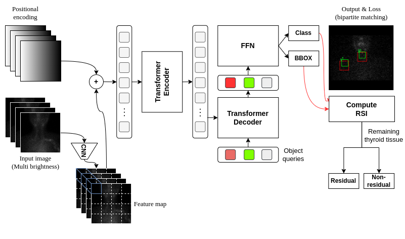
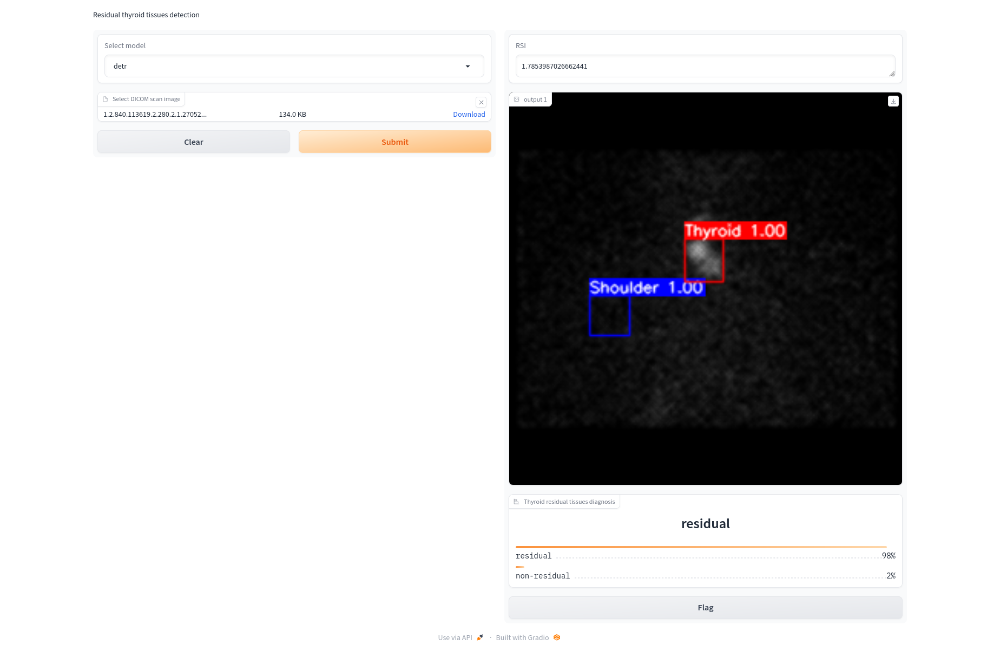
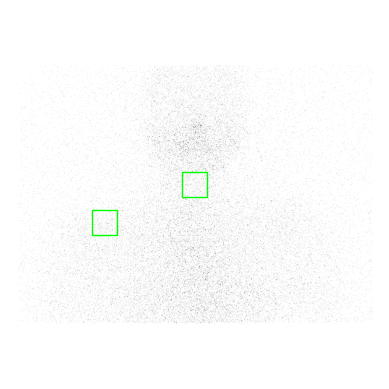
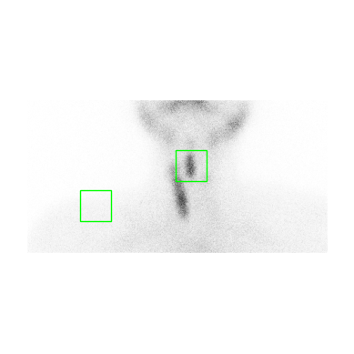
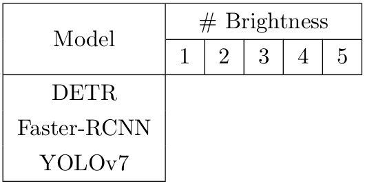
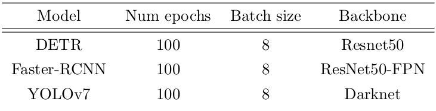
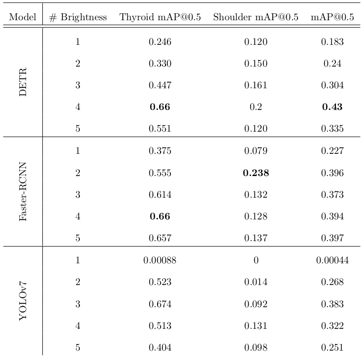

<!-- Improved compatibility of back to top link: See: https://github.com/othneildrew/Best-README-Template/pull/73 -->
<a name="readme-top"></a>

<div align="center">

  [![Pytorch][pytorch-shield]][pytorch-url]
  [![Lightining][lightning-shield]][lightning-url]
  [![LinkedIn][linkedin-shield]][linkedin-url]

</div>

<!-- TABLE OF CONTENTS -->
<details>
  <summary>TABLE OF CONTENTS</summary>
  <ol>
    <li>
      <a href="#about-the-project">About The Project</a>
    </li>
    <li>
      <a href="#getting-started">Getting Started</a>
    </li>
    <li><a href="#dataset">Dataset</a></li>
    <li><a href="#experiment">Experiment</a></li>
    <li><a href="#model-logs">Model logs</a></li>
    <li><a href="#contributing">Contributing</a></li>
    <li><a href="#license">License</a></li>
    <li><a href="#contact">Contact</a></li>
  </ol>
</details>


<!-- ABOUT THE PROJECT -->
## About The Project

The purpose of this project is to build a model to assist in detecting residual thyroid tissue after a patient has undergone thyroidectomy using SPECT images. Experiment on multiple models and give the model the best results. The pipeline to solve this problem is showed as below diagram.

<div align=center>

  |  |
  |:--:| 
  | *Overall proposed detection pipeline* |
</div>

<!-- GETTING STARTED -->
## Getting Started

This is an example of how you may give instructions on setting up your project locally.
To get a local copy up and running follow these simple example steps.

### Prerequisites

You need to have the following package:
* `python >= 3.8`
* `conda >= 23.1.0`

Create and activate conda enviroment:
```sh
conda create -n <your_env_name> python=<python_version>
conda activate <your_env_name>
```

After these steps your conda enviroment should be activated.

### Installation

1. Clone the repo
   ```sh
   git clone https://github.com/Nickeymaths/uet-thyroid-detection.git
   cd uet-thyroid-detection
   ```
2. Install required packages
   ```sh
   pip install -r requirement.txt
   ```

<p align="right">(<a href="#readme-top">back to top</a>)</p>

### Demo

Run the demo with the following command and the result is as shown below
```sh
gradio app.py
```

<div align=center>

  
</div>


<!-- USAGE EXAMPLES -->
## Dataset

The dataset includes a total of 474 SPECT images with WB full-body scintigraphy of size 256x1024, assets images of size 512x512. The data set is divided into train, val, and test sets with the number of samples described as below table.

|                |     Train |     Vald |     Test  |     Total |
|----------------|-----------|----------|-----------|-----------|
|       Samples  | 330       | 94       | 50        |474        |

For each image, the shoulder position and residual thyroid tissue were determined by a rectangular bounding box by experienced physicians as below figures.

Dataset link: https://drive.google.com/drive/folders/1NRFLViFTgWn_cELgd8lU07Hp-8yRH9Qa?usp=sharing

<div align=center>

  |   |
  |:--:| 
  | *Ground truth bounding box of shoulder and neck position; Left is a case of successful tissue removal; Right is a case of unsuccessful tissue deletion and therefore residual thyroid tissue* |
</div>

The input image is preprocessed to 256x256 or 512x512 size before being included in the model.

<p align="right">(<a href="#readme-top">back to top</a>)</p>

## Experiment
This section descript experiment
### Settings
The following tables shows examined models and training settings for each ones.
<div align=center>

   
</div>

### Results

Comparison of models detection performance evaluating on `mAP@0.5` using different number of brightness channel in input images in which 1 brightnes level corresponding original image without bright augmentation.
<div align=center>

  
</div>

<p align="right">(<a href="#readme-top">back to top</a>)</p>

## Models logs

| Model       | Brightness | Path                                                                                                           |
|-------------|------------|----------------------------------------------------------------------------------------------------------------|
| DETR        | 1          | https://drive.google.com/file/d/13up9dBSqsqzbBXMq31HYsXxUyInraEkl/view?usp=share_link                          |
|             | 2          | https://drive.google.com/file/d/1OcuDIp_B5NFelh1okJPdcMyfLzY7na88/view?usp=share_link                          |
|             | 3          | https://drive.google.com/file/d/1yepN_pexmissdHEQzEMa5VXD7I507jN1/view?usp=share_link                          |
|             | 4          | https://drive.google.com/file/d/1Kt70E78yKDPi5HXfDun_ZrjKRcuLt_XG/view?usp=share_link                          |
|             | 5          | https://drive.google.com/file/d/1XTx6VGIj1Ebc252O1sXqQi_vnauvLUrU/view?usp=share_link                          |
|             |            |                                                                                                                |
| Faster-RCNN | 1          | https://drive.google.com/file/d/1c5y8IvPO2P9GAvpiMK6EfwCuL311HfoF/view?usp=share_link                          |
|             | 2          | https://drive.google.com/file/d/1PBNJ4rt3JQJLJ4qbaQb__eQZibBa8EVE/view?usp=share_link                          |
|             | 3          | https://drive.google.com/file/d/16IZHMJYukVkvHCxlwhHMtV-8ihYUzbs6/view?usp=share_link                          |
|             | 4          | https://drive.google.com/file/d/13HEh1LdYZq2-njNReul_QKqGUongnK5E/view?usp=share_link                          |
|             | 5          | https://drive.google.com/file/d/1BIgUFp9BW0sMKgb2P9t7SspmTWuJ03Xb/view?usp=share_link                          |
|             |            |                                                                                                                |
| YOLOv7      | 1          | https://drive.google.com/file/d/1MJQelQBXhskuEg0Won8zHKz9Eqy5Ikce/view?usp=share_link                          |
|             | 2          | https://drive.google.com/file/d/1pYNtKLxjGC8ssbWFW7fwMl_H3rR3n5Dm/view?usp=share_link                          |
|             | 3          | https://drive.google.com/file/d/1C2OUCCHGmxkp928KS4WT-OSTSJePAdMT/view?usp=share_link                          |
|             | 4          | https://drive.google.com/file/d/1UFtaZM51Mf9zwFArkKBxqwxfH34pBDr_/view?usp=share_link                          |
|             | 5          | https://drive.google.com/file/d/1Qu5PnGu0twt5RQ0gxG7r8yJGIC4bEr_K/view?usp=share_link                          |

<p align="right">(<a href="#readme-top">back to top</a>)</p>

<!-- CONTRIBUTING -->
## Contributing

If you have a suggestion that would make this better, please fork the repo and create a pull request. You can also simply open an issue with the tag "enhancement".
Don't forget to give the project a star! Thanks again!

1. Fork the Project
2. Create your Feature Branch (`git checkout -b feature/AmazingFeature`)
3. Commit your Changes (`git commit -m 'Add some AmazingFeature'`)
4. Push to the Branch (`git push origin feature/AmazingFeature`)
5. Open a Pull Request

<p align="right">(<a href="#readme-top">back to top</a>)</p>


<!-- LICENSE -->
## License

Distributed under the GPL License. See `LICENSE.txt` for more information.

<p align="right">(<a href="#readme-top">back to top</a>)</p>


<!-- CONTACT -->
## Contact

VinhPham - [LinkedIn](https://www.linkedin.com/in/phạm-vĩnh-1030bb192/) - ptvinh131@example.com

Project Link: [https://github.com/Nickeymaths/uet-thyroid-detection](https://github.com/Nickeymaths/uet-thyroid-detection)

<p align="right">(<a href="#readme-top">back to top</a>)</p>


<!-- MARKDOWN LINKS & IMAGES -->
<!-- https://www.markdownguide.org/basic-syntax/#reference-style-links -->
[license-shield]: https://img.shields.io/badge/License-GNU%20GPL-blue
[license-url]: https://github.com/othneildrew/Best-README-Template/blob/master/LICENSE.txt
[lightning-shield]: https://img.shields.io/badge/Lightning-792DE4?style=for-the-badge&logo=pytorch-lightning&logoColor=white
[lightning-url]: https://lightning.ai/
[pytorch-shield]: https://img.shields.io/badge/PyTorch-EE4C2C?style=for-the-badge&logo=pytorch&logoColor=white
[pytorch-url]: https://pytorch.org/
[linkedin-shield]: https://img.shields.io/badge/-LinkedIn-black.svg?style=for-the-badge&logo=linkedin&colorB=555
[linkedin-url]: https://www.linkedin.com/in/phạm-vĩnh-1030bb192/